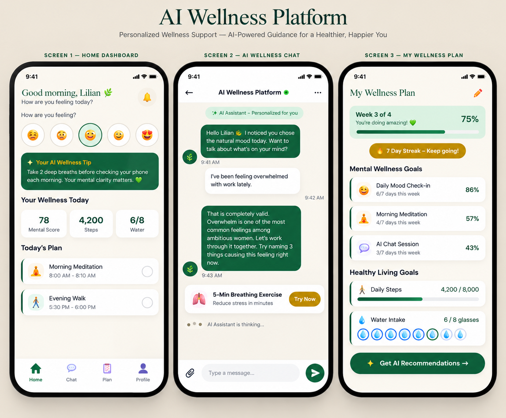

# AI Wellness Platform

## Technical Project Management & Agile Product Delivery Case Study

> An anonymized portfolio case study documenting my role as Technical Project Manager & Scrum Master during the Agile development and delivery of an AI-enabled wellness product.

---

## Project Overview

This case study demonstrates how I structured and coordinated the delivery of an AI-enabled product within a cross-functional Agile team.

My role focused on translating product requirements into actionable delivery work, establishing the Scrum framework, managing the product backlog, coordinating technical dependencies, facilitating Agile ceremonies, and maintaining stakeholder visibility throughout delivery.

**My Role:** Technical Project Manager & Scrum Master  
**Team:** 6-member cross-functional Agile team  
**Duration:** 4 weeks  
**Methodology:** Agile Scrum  
**Tools:** Jira, Confluence, Figma, Slack, Google Meet

---

## Product Preview

---

## What I Delivered

### Product & Requirements

- Translated product vision into structured delivery requirements
- Created and maintained a prioritized product backlog
- Defined user stories and acceptance criteria
- Used story points to support sprint planning and estimation
- Established a clear Definition of Done
- Organized work across key product areas and epics

### Agile Delivery

- Established the Jira Scrum board and delivery workflow
- Planned and coordinated two 2-week sprints
- Facilitated Scrum ceremonies and team coordination
- Maintained sprint visibility through Jira
- Used asynchronous communication to support a distributed team
- Tracked sprint progress, blockers, dependencies, and delivery risks

### Technical Coordination

- Coordinated dependencies between product, design, development, and QA
- Tracked third-party API integration dependencies
- Helped resolve design and technical blockers
- Connected Figma designs and product requirements to delivery tickets
- Supported QA and UAT coordination

### Stakeholder Management

- Maintained regular communication with the Product Owner
- Provided delivery progress and blocker updates
- Used Jira as a shared source of delivery visibility
- Captured feedback from sprint reviews
- Converted new requests into backlog items to protect sprint scope

---

## Delivery Results

| Metric | Result |
|---|---:|
| Sprints Delivered | 2 |
| Sprint Stories Completed | 14 |
| Story Points Completed | 26 |
| Delivery Timeline | 100% on schedule |
| Scope Creep Incidents | 0 |
| Critical Blockers Resolved | 2 |
| Async Standups | 20 |
| Sprint 2 Velocity Improvement | 17% |

The team completed both planned sprints while maintaining delivery visibility and resolving critical dependencies without disrupting the sprint timeline.

---

## Product Scope

The product was designed as an AI-enabled wellness platform providing personalized wellness support and guidance.

Key product areas included:

- User onboarding
- AI-powered wellness conversations
- Personalized wellness support
- Wellness goals and plans
- Provider and service discovery
- Appointment-related workflows
- Notifications
- User progress and engagement

---

## Delivery Approach

### Sprint 1

**Sprint Goal:** Complete the user onboarding flow and core AI experience.

Key activities included:

- Sprint planning
- Backlog refinement
- Story estimation
- Acceptance criteria definition
- Daily asynchronous standups
- Jira progress tracking
- Dependency management
- Sprint review
- Retrospective

**Result:** 6 stories completed and 12 story points delivered.

### Sprint 2

**Sprint Goal:** Complete provider discovery, appointment booking, and notification workflows.

Key activities included:

- Detailed acceptance criteria for sprint tickets
- Sprint planning and estimation
- Jira backlog management
- Technical dependency coordination
- QA collaboration
- Sprint review
- Retrospective
- Stakeholder progress reporting

**Result:** 8 stories completed and 14 story points delivered.

---

## Key Delivery Challenges

### 1. No Structured Backlog

The product vision existed, but the team required a structured delivery framework.

**Action:**  
Created and organized a product backlog containing user stories, acceptance criteria, priorities, and story-point estimates.

### 2. Limited Scrum Experience

The cross-functional team had limited experience working within a structured Scrum delivery process.

**Action:**  
Established Scrum ceremonies, clarified responsibilities, introduced sprint planning and estimation practices, and maintained delivery visibility through Jira.

### 3. Third-Party API Dependency

A third-party API dependency created a potential delivery blocker.

**Action:**  
Tracked the dependency, coordinated with the relevant team members, and escalated the issue early enough to prevent disruption to sprint delivery.

### 4. Design Dependency Conflict

A design dependency had the potential to delay development work.

**Action:**  
Coordinated between design and development to clarify requirements and remove the dependency.

### 5. Scope Creep Risk

New requests could have disrupted sprint commitments.

**Action:**  
Captured new requests in the product backlog rather than allowing unplanned work into active sprints.

**Result:** 0 scope creep incidents during the documented delivery period.

---

## Key Skills Demonstrated

- Technical Project Management
- Agile Project Delivery
- Scrum
- Sprint Planning
- Backlog Management
- Requirements Management
- User Stories
- Acceptance Criteria
- Stakeholder Management
- Risk & Dependency Management
- Technical Coordination
- Cross-functional Team Leadership
- Jira
- Confluence
- Figma Collaboration
- QA & UAT Coordination
- SaaS Product Delivery
- AI Product Delivery
- Product Development
- Delivery Reporting

---

## Project Documentation

Detailed documentation is available in the `/docs` folder:

1. [Project Overview](docs/01-project-overview.md)
2. [Product Requirements](docs/02-product-requirements.md)
3. [Agile Delivery](docs/03-agile-delivery.md)
4. [User Stories & Acceptance Criteria](docs/04-user-stories-and-acceptance-criteria.md)
5. [UX & Product Collaboration](docs/05-ux-and-product-collaboration.md)
6. [Risk & Dependency Management](docs/06-risk-and-dependency-management.md)
7. [Testing & UAT](docs/07-testing-and-uat.md)
8. [Stakeholder Management](docs/08-stakeholder-management.md)
9. [Results & Lessons Learned](docs/09-results-and-lessons.md)
10. [Delivery Handoff](docs/10-delivery-handoff.md)

---

## Tools & Technologies

**Project & Delivery:**  
Jira, Confluence

**Product & UX:**  
Figma

**Communication & Collaboration:**  
Slack, Google Meet

**Methodology:**  
Agile Scrum

---

## My Contribution

I served as the **Technical Project Manager & Scrum Master** during the product development and Agile delivery phase.

My responsibilities included:

- Establishing the Agile delivery structure
- Translating product requirements into actionable work
- Managing and prioritizing the backlog
- Coordinating cross-functional delivery
- Facilitating Scrum ceremonies
- Tracking technical dependencies and blockers
- Supporting QA and UAT coordination
- Maintaining stakeholder visibility
- Protecting sprint scope
- Driving continuous improvement through retrospectives

The product subsequently launched after my engagement ended; this case study focuses specifically on my contribution during the documented development and delivery phase.

---

## Confidentiality Note

This portfolio case study has been anonymized to protect confidential company, product, customer, and implementation details.

The documentation focuses on my project management approach, delivery responsibilities, Agile practices, and professional contribution rather than proprietary product information.
